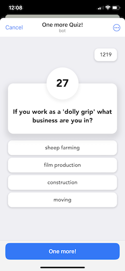
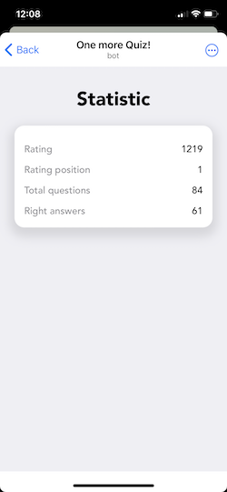

  

[One more Quiz!](https://t.me/OneMoreQuizBot/OneMoreQuiz/) - a simple quiz game. You will have 30 seconds to answer each question, and four possible answers. If the answer is correct, you will get a certain number of points equal to the remaining seconds. Click on the button in the upper right corner to view your statistics.
The game is published as a [Telegram Mini App](https://core.telegram.org/bots/webapps) from the [@OneMoreQuizBot](https://t.me/OneMoreQuizBot)'s menu button. It's also can be opened using [direct link](https://t.me/OneMoreQuizBot/OneMoreQuiz/)

<table border="0">
 <tr>
    <td></td>
    <td></td>
    <td></td>
 </tr>
</table>

> **Note:**
> It looks like there is a known startup error in some desktop clients. If you launch the application using the menu button and for a long time you see a loading page with a gray droid, try another (for example, mobile) client or try to open the application using [direct link](https://t.me/OneMoreQuizBot/OneMoreQuiz/)

## Getting Started
- [Mini App](Readme/README-MiniApp.md)
  - [Requirements](Readme/README-MiniApp.md#requirements)
  - [Build and Run](Readme/README-MiniApp.md#build-and-run)
  - [Edit AppConfig](Readme/README-MiniApp.md#edit-appconfigvue)
  - [Telegram WebApp Api usage](Readme/README-MiniApp.md#telegram-webapp-api-usage)
  - [Deploy](Readme/README-MiniApp.md#deploy)
- [Backend](Readme/README-Backend.md)
  - [Requirements](Readme/README-Backend.md#requirements)
    - [Create your Telegram Bot](Readme/README-Backend.md#create-your-telegram-bot)
    - [Create your database](Readme/README-Backend.md#create-your-database)
    - [Local environment](Readme/README-Backend.md#local-environment)
  - [Build and Run](Readme/README-Backend.md#build-and-run)
  - [Debug](Readme/README-Backend.md#debug)
  - [Deploy](Readme/README-Backend.md#deploy)
  - [Alternative options](Readme/README-Backend.md#alternative-options)
- [Repository structure](#repository-structure)
- [Translations](#translations)
- [License](#license)
 
## Repository structure

First of all, you need clone this repository. Let's get acquainted with its structure:

| File or Directory | Description |
| ------ | ------ |
| [questions.json](https://github.com/AndreVasilev/OneMoreQuiz/blob/readme/questions.json) | File contains questions database in json format |
| [openapi.yaml](https://github.com/AndreVasilev/OneMoreQuiz/blob/readme/openapi.yaml) | [OpenAPI specification](https://swagger.io/specification/). Use [Swagger Editor](https://editor.swagger.io/) to open openapi.yaml |
| [one-more-quiz-mini-app/](https://github.com/AndreVasilev/OneMoreQuiz/tree/readme/one-more-quiz-mini-app) | Source codes of the [Mini App](Readme/README-MiniApp.md) |
| [yc-serverless-backend/](https://github.com/AndreVasilev/OneMoreQuiz/tree/readme/yc-serverless-backend) | Source codes of the serverless [Backend](Readme/README-Backend.md) |
| [.gitignore](https://github.com/AndreVasilev/OneMoreQuiz/blob/readme/.gitignore) | Just a [gitignore](https://git-scm.com/docs/gitignore) file |
| [LICENSE](https://github.com/AndreVasilev/OneMoreQuiz/blob/readme/LICENSE) | MIT license |
| [Readme/](https://github.com/AndreVasilev/OneMoreQuiz/tree/readme/Readme) | Readme resources |
| README.md | You're it now |

## Translations

* [Русский](Readme/ru/README.md)

If you'd like to contribute a translation, please fork this repository, add a directory of your language to Readme/ directory and open a PR

## License

This library is released under the MIT license. See [LICENSE](https://github.com/AndreVasilev/OneMoreQuiz/blob/readme/LICENSE) for details
