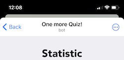

# One more Quiz! - Mini App

- [Requirements](#requirements)
- [Build and Run](#build-and-run)
- [Edit AppConfig](#edit-appconfigvue)
- [Telegram WebApp Api usage](#telegram-webapp-api-usage)
- [Deploy](#deploy)

## Requirements
Update or install neccesary software
- [node](https://nodejs.org/en/download) >= 18.18.0
- [npm](https://docs.npmjs.com/downloading-and-installing-node-js-and-npm) >= 10.1.0
- [Vue.js](https://vuejs.org/guide/introduction.html)
```npm install vue```
- [Vue CLI](https://cli.vuejs.org/guide/installation.html) >= 5.0.8

## Build and Run

Open terminal, move to the mini app's project directory and run [Vue CLI serve command](https://cli.vuejs.org/guide/cli-service.html#cli-service)
```
cd /path/to/repo/dir/one-more-quiz-mini-app/
npm run serve
```
After server deployment succeed open an app running url in a web browser. Done!

<details>
  <summary>Possible uncaught runtime errors</summary>


Access to fetch at default endpoint from localhost is blocked by CORS policy. That is why you can see a scary red alert with some **uncaught runtime errors**.

[Learn how](https://cli.vuejs.org/guide/deployment.html#cors) to avoid this errors
</details>

When you run the app locally in browser you won't see any native MainButton or BackButton. To reproduce their functionalty you can uncomment debug buttons

```html
<!-- Uncomment when running in develop mode locally to enable MainButton functionality -->
<button v-on:click="startOneMore">One more!</button>
```
**[QuizScreen.vue](https://github.com/AndreVasilev/OneMoreQuiz/blob/master/one-more-quiz-mini-app/src/components/QuizScreen.vue)**

```html
<!-- Uncomment when running in develop mode locally to enable BackButton functionality -->
<button @click="$emit('to-quiz')">Back</button>
```
**[StatisticScreen.vue](https://github.com/AndreVasilev/OneMoreQuiz/blob/master/one-more-quiz-mini-app/src/components/StatisticScreen.vue)**

## Edit [AppConfig.vue](https://github.com/AndreVasilev/OneMoreQuiz/blob/master/one-more-quiz-mini-app/src/components/AppConfig.vue)
```js
export default {
  api: {
    question:   'https://functions.yandexcloud.net/d4etnmqu0d9a7lbns5lv',
    user:       'https://functions.yandexcloud.net/d4e1a28fij57sur14pak'
  },
  timer: 30,
  tgInitData: function() {
        return window.Telegram.WebApp.initData
    },
};
```
| Property | Type | Description |
| ------ | ------ | ------ |
| api.question | String | Question api endpoint |
| api.user | String | User api endpoint |
| timer | Integer | Number of seconds for each question |
| tgInitData | () => String | A function that returns **initData** property from Telegram WebApp Api. If you want to run the locally, you would like to set a constant value instead of ```return window.Telegram.WebApp.initData```. You can retrieve your **initData** using [Debug Mode for Mini Apps](https://core.telegram.org/bots/webapps#debug-mode-for-mini-apps) and paste instead of real **initData** like this: ```return "user=%1A...31"``` |
> **Note**
> **initData** should be received from the same bot which token you use to validate data on a server

## Telegram WebApp Api usage

<details>
  <summary>telegram-web-app.js</summary>

```html
<head>
  <script src="https://telegram.org/js/telegram-web-app.js"></script>
</head>
```
**[index.html](https://github.com/AndreVasilev/OneMoreQuiz/blob/master/one-more-quiz-mini-app/public/index.html)**

To connect your Mini App to the Telegram client, place the script telegram-web-app.js in the <head> tag before any other scripts. [Learn more](https://core.telegram.org/bots/webapps#initializing-mini-apps)
</details>

<details>
  <summary>window.Telegram.WebApp.ready()</summary>

```js
import { createApp } from 'vue'
import App from './App.vue'
createApp(App).mount('#app');
window.Telegram.WebApp.ready();
```
**[main.js](https://github.com/AndreVasilev/OneMoreQuiz/blob/master/one-more-quiz-mini-app/src/main.js)**

A method that informs the Telegram app that the Mini App is ready to be displayed.
It is recommended to call this method as early as possible, as soon as all essential interface elements are loaded. Once this method is called, the loading placeholder is hidden and the Mini App is shown. [Learn more](https://core.telegram.org/bots/webapps#initializing-mini-apps)
</details>

<details>
  <summary>window.Telegram.WebApp.initData</summary>

```js
  tgInitData: function() {
    return window.Telegram.WebApp.initData
  }
```
**[AppConfig.vue](https://github.com/AndreVasilev/OneMoreQuiz/blob/master/one-more-quiz-mini-app/src/components/AppConfig.vue)**

This object contains data that is transferred to the Mini App when it is opened. The app sends this data to the server to validate user's request and retrieve user's id from it. [Learn more](https://core.telegram.org/bots/webapps#webappinitdata)
</details>

<details>
  <summary>window.Telegram.WebApp.MainButton</summary>

  

```js
mainButtonSetup: function(isVisible) {
  window.Telegram.WebApp.MainButton.isVisible = isVisible;
  if (isVisible) {
    window.Telegram.WebApp.MainButton.setText("One more!");
    var self = this;
    window.Telegram.WebApp.MainButton.onClick(function() {
      self.startOneMore();
    });
  }
}
```
**[QuizScreen.vue](https://github.com/AndreVasilev/OneMoreQuiz/blob/master/one-more-quiz-mini-app/src/components/QuizScreen.vue)**

Change MainButton visibility and title for your use cases. In the game this button must be visible only on the QuizScreen. And it must call the startOneMore() function. [Learn more](https://core.telegram.org/bots/webapps#mainbutton)
</details>

<details>
  <summary>window.Telegram.WebApp.HapticFeedback</summary>

```js
hapticFeedback: function() {
  if (window.Telegram.WebApp.isVersionAtLeast("6.1")) {
    window.Telegram.WebApp.HapticFeedback.selectionChanged()
  }
}
```
**[QuizScreen.vue](https://github.com/AndreVasilev/OneMoreQuiz/blob/master/one-more-quiz-mini-app/src/components/QuizScreen.vue)**

Tell the Telegram app to play the appropriate haptic, when a user has changed a selection. This method is available in Bot API 6.1+, so don't forget to check WebApp's api current version. [Learn more](https://core.telegram.org/bots/webapps#hapticfeedback)
</details>

<details>
  <summary>window.Telegram.WebApp.BackButton</summary>

  

```js
backButtonSetup: function() {
  var self = this;
  window.Telegram.WebApp.BackButton.isVisible = true;
  window.Telegram.WebApp.BackButton.onClick(function() {
    window.Telegram.WebApp.BackButton.isVisible = false;
    self.$emit('to-quiz')
  });
}
```
**[StatisticScreen.vue](https://github.com/AndreVasilev/OneMoreQuiz/blob/master/one-more-quiz-mini-app/src/components/StatisticScreen.vue)**

Configure BackButton when the StatisticScreen is opened: make it visible and set the onClick callback. [Learn more](https://core.telegram.org/bots/webapps#backbutton)
</details>

<details>
  <summary>window.Telegram.WebApp.ThemeParams</summary>

 <table border="0">
 <tr>
    <td></td>
    <td></td>
 </tr>
</table>

```html
<html lang="" style="background-color:var(--tg-theme-secondary-bg-color);">
```
**[index.html](https://github.com/AndreVasilev/OneMoreQuiz/blob/master/one-more-quiz-mini-app/public/index.html)**

```css
.profile-button {
  color: var(--tg-theme-text-color);
  background-color: var(--tg-theme-bg-color);
}
.question-container {
  background-color: var(--tg-theme-bg-color);
}
.timer-container {
  background-color: var(--tg-theme-bg-color);
}
.timer {
  color: var(--tg-theme-text-color);
}
.question {
  color: var(--tg-theme-text-color);
}
.answers-container label {
  color: var(--tg-theme-text-color);
}
.answer {
  background-color: var(--tg-theme-bg-color);
}
```
**[QuizScreen.vue](https://github.com/AndreVasilev/OneMoreQuiz/blob/master/one-more-quiz-mini-app/src/components/QuizScreen.vue)**

```css
.main-title {
  color: var(--tg-theme-text-color);
}
.container {
  background-color: var(--tg-theme-bg-color);
}
.title {
  color: var(--tg-theme-hint-color);
}
.value {
  color: var(--tg-theme-text-color);
}
```
**[StatisticScreen.vue](https://github.com/AndreVasilev/OneMoreQuiz/blob/master/one-more-quiz-mini-app/src/components/StatisticScreen.vue)**

Adjust the appearance of the interface to match the Telegram user's app in real time. [Learn more](https://core.telegram.org/bots/webapps#themeparams)
</details>

## Deploy

1. To create a production build run
   ```sh
   npm run build
   ```

3. You can deploy the built content in the ```dist/``` directory to any static file server
- [Amazon S3](https://docs.aws.amazon.com/AmazonS3/latest/userguide/WebsiteHosting.html)
- [Yandex Object Storage](https://cloud.yandex.com/en/docs/tutorials/web/static)

  or any other S3. [Learn more deployment options](https://cli.vuejs.org/guide/deployment.html#deployment)
