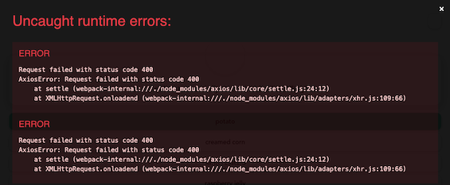

# One more Quiz! - Mini App

- [Требования](#requirements)
- [Сборка и запуск](#build-and-run)
- [Редактирование AppConfig](#edit-appconfigvue)
- [Использование Telegram WebApp Api](#telegram-webapp-api-usage)
- [Деплой](#deploy)

## Требования
Обновите или установите необходимое программное обеспечение
- [node](https://nodejs.org/ru/download) >= 18.18.0
- [npm](https://docs.npmjs.com/downloading-and-installing-node-js-and-npm) >= 10.1.0
- [Vue.js](https://vuejs.org/guide/introduction.html)
```npm install vue```
- [Vue CLI](https://cli.vuejs.org/guide/installation.html) >= 5.0.8

## Сборка и запуск

Откройте терминал, перейдите в каталог проекта mini apps и запустите [команду Vue CLI serve](https://cli.vuejs.org/guide/cli-service.html#cli-service)
```
cd /path/to/repo/dir/one-more-quiz-mini-app/
npm run serve
```
После успешного развертывания сервера откройте URL-адрес запущенного приложения в веб-браузере. Готово!

<details>
  <summary>Возможные неперехваченные ошибки во время выполнения</summary>



Доступ к выборке в конечной точке по умолчанию с localhost заблокирован политикой CORS. Вот почему вы можете увидеть пугающее красное предупреждение с некоторыми **неперехваченными ошибками во время выполнения**.

[Узнайте](https://cli.vuejs.org/guide/deployment.html#cors), как избежать этих ошибок
</details>

Когда вы запускаете приложение локально в браузере, вы не увидите ни встроенной главной кнопки, ни обратной кнопки. Чтобы воспроизвести их функциональность, вы можете раскомментировать кнопки отладки

```html
<!-- Раскомментируйте при запуске в режиме разработки локально, чтобы включить функциональность главной кнопки -->
<button v-on:click="startOneMore">One more!</button>
```
**[QuizScreen.vue](https://github.com/AndreVasilev/OneMoreQuiz/blob/master/one-more-quiz-mini-app/src/components/QuizScreen.vue)**

```html
<!-- Раскомментируйте при запуске в режиме разработки локально, чтобы включить функциональность кнопки "Назад" -->
<button @click="$emit('to-quiz')">Back</button>
```
**[StatisticScreen.vue](https://github.com/AndreVasilev/OneMoreQuiz/blob/master/one-more-quiz-mini-app/src/components/StatisticScreen.vue)**

## Редактирование [AppConfig.vue](https://github.com/AndreVasilev/OneMoreQuiz/blob/master/one-more-quiz-mini-app/src/components/AppConfig.vue)
```js
export default {
  api: {
    question:   'https://functions.yandexcloud.net/d4etnmqu0d9a7lbns5lv',
    user:       'https://functions.yandexcloud.net/d4e1a28fij57sur14pak'
  },
  timer: 30,
  tgInitData: function() {
        return window.Telegram.WebApp.initData
    },
};
```
| Свойство | Тип | Описание |
| ------ | ------ | ------ |
| api.question | String | Адрес Question api |
| api.user | String | Адрес User api |
| timer | Integer | Количество секунд, отведенное на каждый вопрос |
| tgInitData | () => String | Функция, которая возвращает свойство **initData** из Telegram WebApp Api. Если вы хотите запустить программу локально, вы захотите установить постоянное значение вместо ```return window.Telegram.WebApp.initData```. Вы можете получить **initData** используя [Debug Mode для Mini Apps](https://core.telegram.org/bots/webapps#debug-mode-for-mini-apps)  и подставьте вместо реального **initData** вот так: ```return "user=%1A...31"``` |
> **Примечание**
> **initData** должны быть получены от того же бота, токен которого вы используете для проверки данных на сервере

## Использование Telegram WebApp Api

<details>
  <summary>telegram-web-app.js</summary>

```html
<head>
  <script src="https://telegram.org/js/telegram-web-app.js"></script>
</head>
```
**[index.html](https://github.com/AndreVasilev/OneMoreQuiz/blob/master/one-more-quiz-mini-app/public/index.html)**

Чтобы подключить ваше мини-приложение к клиенту Telegram, разместите скрипт telegram-web-app.js в теге <head> перед любыми другими скриптами. [Узнать больше](https://core.telegram.org/bots/webapps#initializing-mini-apps)
</details>

<details>
  <summary>window.Telegram.WebApp.ready()</summary>

```js
import { createApp } from 'vue'
import App from './App.vue'
createApp(App).mount('#app');
window.Telegram.WebApp.ready();
```
**[main.js](https://github.com/AndreVasilev/OneMoreQuiz/blob/master/one-more-quiz-mini-app/src/main.js)**

Метод, который информирует приложение Telegram о том, что мини-приложение готово к отображению.
Рекомендуется вызывать этот метод как можно раньше, как только будут загружены все необходимые элементы интерфейса. Как только этот метод вызывается, загрузочный заполнитель скрывается и отображается мини-приложение. [Узнать больше](https://core.telegram.org/bots/webapps#initializing-mini-apps)
</details>

<details>
  <summary>window.Telegram.WebApp.initData</summary>

```js
  tgInitData: function() {
    return window.Telegram.WebApp.initData
  }
```
**[AppConfig.vue](https://github.com/AndreVasilev/OneMoreQuiz/blob/master/one-more-quiz-mini-app/src/components/AppConfig.vue)**

Этот объект содержит данные, которые передаются в мини-приложение при его открытии. Приложение отправляет эти данные на сервер, чтобы подтвердить запрос пользователя и извлечь из него идентификатор пользователя. [Узнать больше](https://core.telegram.org/bots/webapps#webappinitdata)
</details>

<details>
  <summary>window.Telegram.WebApp.MainButton</summary>

  

```js
mainButtonSetup: function(isVisible) {
  window.Telegram.WebApp.MainButton.isVisible = isVisible;
  if (isVisible) {
    window.Telegram.WebApp.MainButton.setText("One more!");
    var self = this;
    window.Telegram.WebApp.MainButton.onClick(function() {
      self.startOneMore();
    });
  }
}
```
**[QuizScreen.vue](https://github.com/AndreVasilev/OneMoreQuiz/blob/master/one-more-quiz-mini-app/src/components/QuizScreen.vue)**

Измените видимость главной кнопки и заголовок для ваших вариантов использования. В игре эта кнопка должна быть видна только на экране викторины. И он должен вызвать функцию startOneMore(). [Узнать больше](https://core.telegram.org/bots/webapps#mainbutton)
</details>

<details>
  <summary>window.Telegram.WebApp.HapticFeedback</summary>

```js
hapticFeedback: function() {
  if (window.Telegram.WebApp.isVersionAtLeast("6.1")) {
    window.Telegram.WebApp.HapticFeedback.selectionChanged()
  }
}
```
**[QuizScreen.vue](https://github.com/AndreVasilev/OneMoreQuiz/blob/master/one-more-quiz-mini-app/src/components/QuizScreen.vue)**

Сообщите приложению Telegram, чтобы оно воспроизводило соответствующую тактильную информацию, когда пользователь изменил выбор. Этот метод доступен в обоих версиях API 6.1+, поэтому не забудьте проверить текущую версию api WebApp. [Узнать больше](https://core.telegram.org/bots/webapps#hapticfeedback)
</details>

<details>
  <summary>window.Telegram.WebApp.BackButton</summary>

  

```js
backButtonSetup: function() {
  var self = this;
  window.Telegram.WebApp.BackButton.isVisible = true;
  window.Telegram.WebApp.BackButton.onClick(function() {
    window.Telegram.WebApp.BackButton.isVisible = false;
    self.$emit('to-quiz')
  });
}
```
**[StatisticScreen.vue](https://github.com/AndreVasilev/OneMoreQuiz/blob/master/one-more-quiz-mini-app/src/components/StatisticScreen.vue)**

Настройте кнопку возврата при открытии экрана статистики: сделайте ее видимой и установите обратный вызов onClick. [Узнать больше](https://core.telegram.org/bots/webapps#backbutton)
</details>

<details>
  <summary>window.Telegram.WebApp.ThemeParams</summary>

 <table border="0">
 <tr>
    <td></td>
    <td></td>
 </tr>
</table>

```html
<html lang="" style="background-color:var(--tg-theme-secondary-bg-color);">
```
**[index.html](https://github.com/AndreVasilev/OneMoreQuiz/blob/master/one-more-quiz-mini-app/public/index.html)**

```css
.profile-button {
  color: var(--tg-theme-text-color);
  background-color: var(--tg-theme-bg-color);
}
.question-container {
  background-color: var(--tg-theme-bg-color);
}
.timer-container {
  background-color: var(--tg-theme-bg-color);
}
.timer {
  color: var(--tg-theme-text-color);
}
.question {
  color: var(--tg-theme-text-color);
}
.answers-container label {
  color: var(--tg-theme-text-color);
}
.answer {
  background-color: var(--tg-theme-bg-color);
}
```
**[QuizScreen.vue](https://github.com/AndreVasilev/OneMoreQuiz/blob/master/one-more-quiz-mini-app/src/components/QuizScreen.vue)**

```css
.main-title {
  color: var(--tg-theme-text-color);
}
.container {
  background-color: var(--tg-theme-bg-color);
}
.title {
  color: var(--tg-theme-hint-color);
}
.value {
  color: var(--tg-theme-text-color);
}
```
**[StatisticScreen.vue](https://github.com/AndreVasilev/OneMoreQuiz/blob/master/one-more-quiz-mini-app/src/components/StatisticScreen.vue)**

Меняйте внешний вид интерфейса в соответствии с приложением Telegram в режиме реального времени. [Узнать больше](https://core.telegram.org/bots/webapps#themeparams)
</details>

## Деплой

1. Для создания продакшен сборки запустите команду
   ```sh
   npm run build
   ```

3. Вы можете развернуть собранный контент в каталоге ```dist/``` на любом статическом файловом сервере
- [Amazon S3](https://docs.aws.amazon.com/AmazonS3/latest/userguide/WebsiteHosting.html)
- [Yandex Object Storage](https://cloud.yandex.com/en/docs/tutorials/web/static)

  или на любом другом S3. [Узнать о других способах деплоя](https://cli.vuejs.org/guide/deployment.html#deployment)
