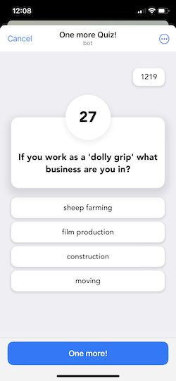
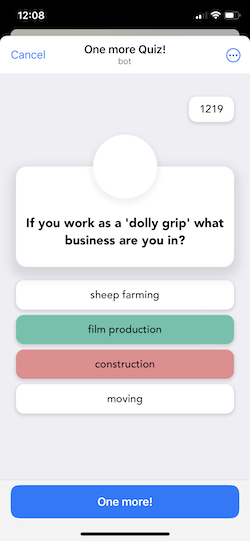
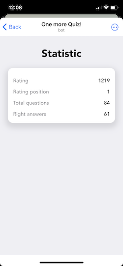

  

[One more Quiz!](https://t.me/OneMoreQuizBot/OneMoreQuiz/) - это простая игра-викторина с вопросом и четырьмя ответами. У пользователя есть 30 секунд, чтобы ответить на каждый вопрос. Если ответ правильный, пользователь получает определенное количество баллов, равное оставшимся секундам. В правом верхнем углу есть кнопка, которая открывает второй экран с рейтингом пользователя.
Игра опубликована в виде [Telegram Mini App](https://core.telegram.org/bots/webapps) через кнопку меню [@OneMoreQuizBot](https://t.me/OneMoreQuizBot). Её также можно открыть с помощью [прямой ссылки](https://t.me/OneMoreQuizBot/OneMoreQuiz/)

<table border="0">
 <tr>
    <td></td>
    <td></td>
    <td></td>
 </tr>
</table>

## Приступая к работе
- [Mini App](README-MiniApp.md)
  - [Требования](README-MiniApp.md#requirements)
  - [Сборка и запуск](README-MiniApp.md#build-and-run)
  - [Редактирование AppConfig](README-MiniApp.md#edit-appconfigvue)
  - [Использование Telegram WebApp Api](README-MiniApp.md#telegram-webapp-api-usage)
  - [Деплой](README-MiniApp.md#deploy)
- [Backend](README-Backend.md)
  - [Требования](README-Backend.md#requirements)
    - [Создайте своего Telegram бота](README-Backend.md#create-your-telegram-bot)
    - [Создайте свою базу данных](README-Backend.md#create-your-database)
    - [Локальное окружение](README-Backend.md#local-environment)
  - [Сборка и запуск](README-Backend.md#build-and-run)
  - [Дебаг](README-Backend.md#debug)
  - [Деплой](README-Backend.md#deploy)
  - [Альтернативные опции](README-Backend.md#alternative-options)
- [Структура репозитория](#repository-structure)
- [Переводы](#translations)
- [Лицензия](#license)
 
## Структура репозитория

Прежде всего, вам нужно клонировать этот репозиторий. Давайте познакомимся с его структурой:

| Файл или Папка | Описание |
| ------ | ------ |
| [questions.json](https://github.com/AndreVasilev/OneMoreQuiz/blob/readme/questions.json) | Файл содержит базу данных вопросов в формате json |
| [openapi.yaml](https://github.com/AndreVasilev/OneMoreQuiz/blob/readme/openapi.yaml) | [OpenAPI спецификация](https://swagger.io/specification/). Используйте [Swagger Editor](https://editor.swagger.io/), чтобы открыть openapi.yaml |
| [one-more-quiz-mini-app/](https://github.com/AndreVasilev/OneMoreQuiz/tree/readme/one-more-quiz-mini-app) | Исходные коды [Mini App](README-MiniApp.md) |
| [yc-serverless-backend/](https://github.com/AndreVasilev/OneMoreQuiz/tree/readme/yc-serverless-backend) | Исходные коды бессерверного [Backend](README-Backend.md) |
| [.gitignore](https://github.com/AndreVasilev/OneMoreQuiz/blob/readme/.gitignore) | Просто [gitignore](https://git-scm.com/docs/gitignore) файл |
| [LICENSE](https://github.com/AndreVasilev/OneMoreQuiz/blob/readme/LICENSE) | MIT лицензия |
| [Readme/](https://github.com/AndreVasilev/OneMoreQuiz/tree/readme/Readme) | Ресурсы для описания |
| README.md | Ты сейчас читаешь этот файл |

## Переводы

* [English](https://github.com/AndreVasilev/OneMoreQuiz)

Если вы хотите внести свой вклад в перевод, пожалуйста, сделайте форк этого репозитория, добавьте каталог вашего языка в папку Readme/ и откройте PR

## License

Эта библиотека выпущена по лицензии MIT. Смотрите [LICENSE](https://github.com/AndreVasilev/OneMoreQuiz/blob/readme/LICENSE) для получения подробной информации
